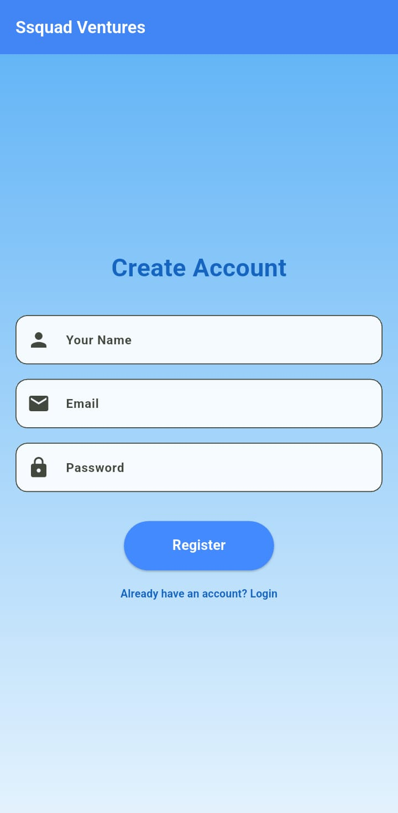
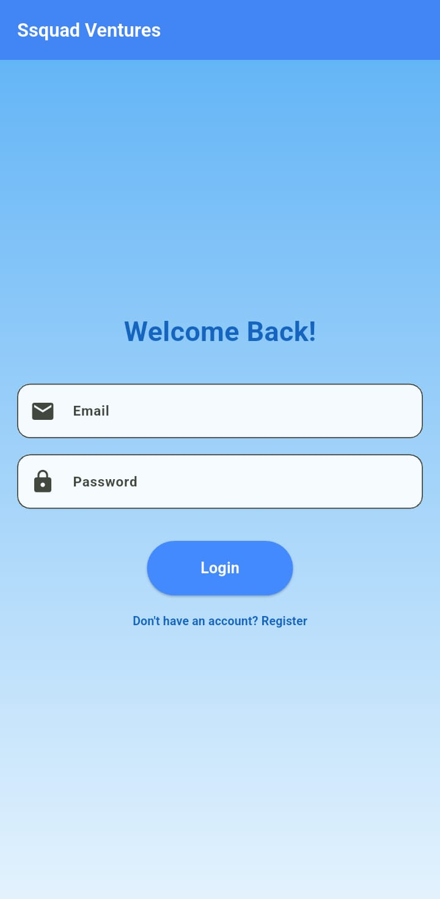
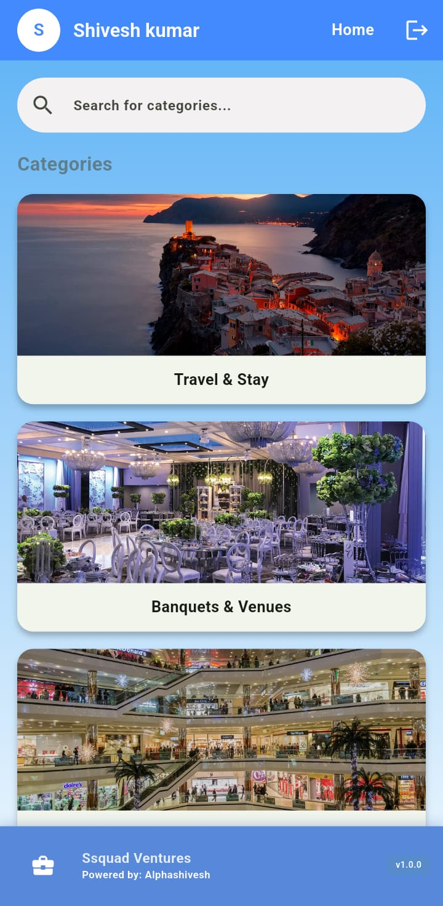
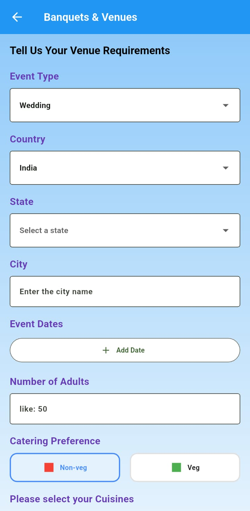
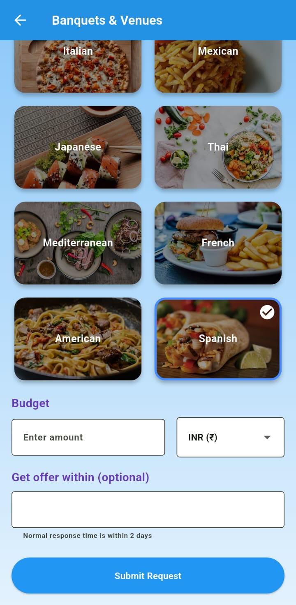
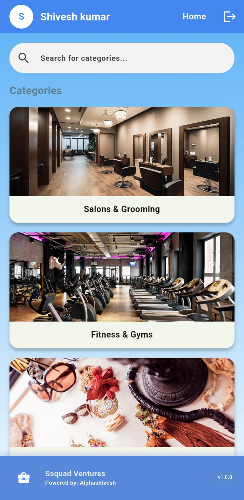
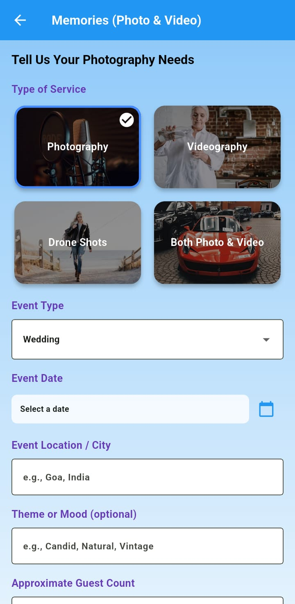
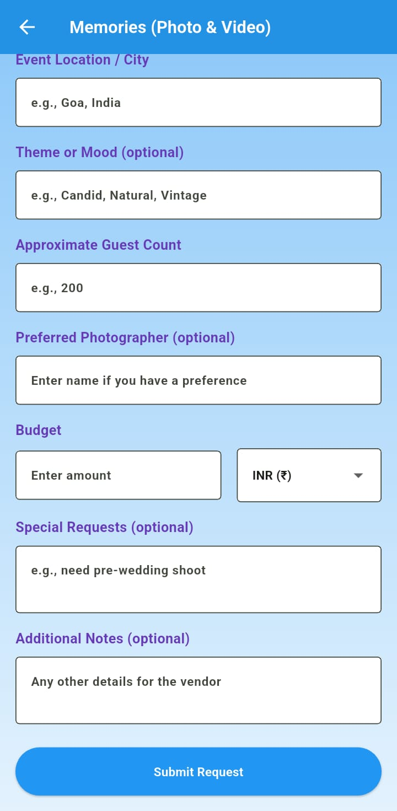
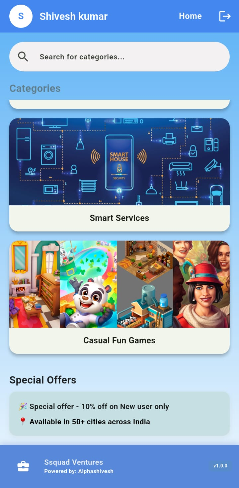

# Mobile App

A full-stack mobile application built with Flutter and Node.js that connects users with a wide variety of local service providers. Users can submit detailed requests for services ranging from banquet halls and travel to photographers and fitness trainers.

---

## 📸 Snapshots

<table>
  <tr>
    <td align="center"><strong>Register Screen</strong></td>
    <td align="center"><strong>Login Screen</strong></td>
    <td align="center"><strong>Home Screen</strong></td>
  </tr>
 
  <tr>
    <td></td>
    <td></td>
    <td></td>
  </tr> 
  <tr>
    <td align="center"><strong>Banquets Form</strong></td>
    <td align="center"><strong>Banquets Form</strong></td>
    <td align="center"><strong>Home Screen</strong></td>
  </tr>
  <tr>
    <td></td>
    <td></td>
    <td></td>
  </tr> 
  <tr>
    <td align="center"><strong>Memories Form</strong></td>
    <td align="center"><strong>Memories Form</strong></td>
    <td align="center"><strong>Home Screen</strong></td>
  </tr>
  <tr>
    <td></td>
    <td></td>
    <td></td>
  </tr> 
</table>

---

## 📜 Table of Contents

- [About The Project](#about-the-project)
- [Architectural Overview](#architectural-overview)
- [Tech Stack](#tech-stack)
- [Getting Started](#getting-started)
  - [Prerequisites](#prerequisites)
  - [Database Setup](#database-setup)
  - [Backend Setup](#backend-setup)
  - [Frontend Setup](#frontend-setup)
- [Features](#features)
- [Project Structure](#project-structure)
- [API Endpoints](#api-endpoints)
- [Contribution](#contributing)
- [Future Improvements](#future-improvements)
- [Contact & License](#contact-license)

---

## 📖 About The Project

This application serves as a comprehensive platform for users to find and request services from various vendors. It features a dynamic home screen that lists all available service categories, a user registration and login system, and a unique, detailed request form for each category. The project is built with a modern tech stack, featuring a cross-platform Flutter application for the frontend and a robust Node.js REST API for the backend, all connected to a MySQL database.

---

## 🏛️ Architectural Overview

This project follows a standard **client-server architecture**:

* **Client (Flutter App)**: The mobile application that users interact with. It is responsible for the UI and user experience. It sends HTTP requests to the backend to fetch or submit data.
* **Server (Node.js API)**: The backend acts as a bridge between the client and the database. It handles business logic, processes requests from the app, and interacts with the MySQL database.
* **Database (MySQL)**: The database stores all persistent data, including user accounts, categories, and service requests.

---

## 🛠 Tech Stack

This project is built using the following technologies:

-   *Frontend:* Flutter (Dart)
-   *Backend:* Node.js, Express.js
-   *Database:* MySQL
-   *Security:* bcrypt for password hashing

---

## 🚀 Getting Started

To get a local copy up and running, follow these simple steps.

### Prerequisites

Make sure you have the following software installed on your machine:
* Node.js ([Download here](https://nodejs.org/))
* Flutter SDK ([Installation guide](https://flutter.dev/docs/get-started/install))
* A MySQL server (like XAMPP, WAMP, MySQL Workbench or a standalone instance)

### Database Setup

1.  Ensure your MySQL server is running.
2.  Using a database management tool (like MySQL Workbench, DBeaver, or phpMyAdmin), run the setup.sql script provided in the project. This will create the app database and all the necessary tables.

### Backend Setup

1.  Navigate to the backend directory:
    bash
    cd backend
    
2.  Install the required NPM packages:
    bash
    npm install
    
3.  Create a .env file in the backend directory and add your database credentials:
    env
    DB_HOST=localhost
    DB_USER=root
    DB_PASSWORD=your_mysql_password
    DB_NAME=app
    
4.  Start the server:
    bash
    npm run dev
    
    The API server should now be running on http://localhost:3000.

### Frontend Setup

1.  Navigate to the frontend_app directory:
    bash
    cd frontend_app
    
2.  Get the Flutter packages:
    bash
    flutter pub get
    
3.  *Crucial Step:* Open the lib/services/api_service.dart file. Find the _baseUrl variable and replace the placeholder IP address with your computer's actual local IP address (which you can find by running ipconfig on Windows or ifconfig on macOS/Linux).
    dart
    // Example
    static const String _baseUrl = '[http://192.168.1.10:3000/api](http://192.168.1.10:3000/api)';
    
4.  Run the app on your connected device or emulator:
    bash
    flutter run
    

---

## ✨ Features

-   *Full User Authentication:* Secure user registration and login system.
-   *Dynamic Home Screen:* Categories are loaded dynamically from the backend.
-   *Search Functionality:* Filter categories on the home screen in real-time.
-   *12+ Unique Request Forms:* Each category has its own detailed and customized form.
-   *Modern UI/UX:*
    -   Consistent color themes and styling across all forms.
    -   Image-based card selections for a rich user experience.
    -   Dependent dropdowns for country/state selection.
    -   Fixed header and footer with a scrollable content area.

---

##  📑 Project Structure 

```
mobile-app/
├── backend/
│   ├── node_modules/
│   ├── .env
│   ├── db.js
│   ├── index.js
│   ├── package.json
│   └── db.sql      
│
├── frontend_app/
│   ├── lib/
│   │   ├── data/
│   │   ├── screens/
│   │   ├── services/
│   │   └── widgets/
│   └── pubspec.yaml
│
└── README.md
```

---

## 🔌 API Endpoints

The backend provides the following RESTful API endpoints:

| Method | Endpoint                    | Description                       |
| :----- | :-------------------------- | :-------------------------------- |
| GET  | /api/categories           | Fetches all service categories.   |
| POST | /api/register             | Registers a new user.             |
| POST | /api/login                | Logs in an existing user.         |
| POST | /api/banquet-requests     | Submits a banquet request form.   |
| POST | /api/travel-requests      | Submits a travel request form.    |
| POST | /api/retail-requests      | Submits a retail request form.    |
| POST | /api/saloon-requests      | Submits a saloon request form.    |
| POST | /api/gym-requests         | Submits a gym request form.       |
| POST | /api/jewelry-requests     | Submits a jewelry request form.   |
| POST | /api/fashion-requests     | Submits a fashion request form.   |
| POST | /api/gifts-requests       | Submits a gifts request form.     |
| POST | /api/memories-requests    | Submits a memories request form.  |
| POST | /api/craft-requests       | Submits a craft request form.     |
| POST | /api/smart-services-requests | Submits a service request form.   |
| POST | /api/games-requests       | Submits a games request form.     |

---

## 🤝 Contributing

Contributions are what make the open-source community such an amazing place to learn, inspire, and create. Any contributions you make are **greatly appreciated**.

If you have a suggestion that would make this better, please fork the repo and create a pull request. You can also simply open an issue with the tag "enhancement".
1.  Fork the Project
2.  Create your Feature Branch (`git checkout -b feature/AmazingFeature`)
3.  Commit your Changes (`git commit -m 'Add some AmazingFeature'`)
4.  Push to the Branch (`git push origin feature/AmazingFeature`)
5.  Open a Pull Request

---

## 🌟 Future Improvements

While the core functionality is complete, here are some features planned for future development:

-   **Vendor-side Application**: A separate app or web dashboard for vendors to view and bid on user requests.
-   **Real-time Chat**: Implement a real-time chat feature between users and vendors using WebSockets.
-   **Payment Gateway Integration**: Integrate a system like Stripe or Razorpay to handle transactions.
-   **User Profile Management**: Allow users to view their request history and manage profile information.
-   **Push Notifications**: Send notifications to users and vendors about new requests and bids.

---

## 📬 Contact

Shivesh Kumar  - shiveshkumar73520@gmail.com

Project Link: [https://github.com/Alphashivesh/mobile_app](https://github.com/Alphashivesh/mobile_app)

---

## 📝 License

Distributed under the MIT License. See `LICENSE` for more information.

---
